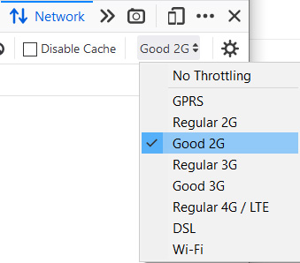
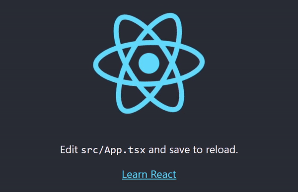
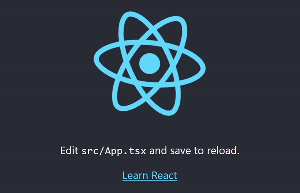

# React demo app with loading splash screen
This simple app demonstrates idea of writing a webpack plugin to make the app display loading progress bar
which shows the actual state of application loading progress.
  
This project was bootstrapped with [Create React App](https://github.com/facebook/create-react-app).
```sh
npx create-react-app spa-bootloader --template typescript --use-npm
```

## How to run
```sh
npm install
npm run build
npx serve -u build
```
Open [http://localhost:5000](http://localhost:5000) to view it in the browser.
Open dev console `F12` and play with network throttling to see bootloader in action.



There are two bootloaders with different approach:
```
./src/bootloader/tag-bootloader.ts
./src/bootloader/xhr-bootloader.ts
```
To change the current one edit `config/craco.config.js`
```javascript
new BootloaderPlugin(HtmlWebpackPlugin, {script: './src/bootloader/tag-bootloader.ts'})
```

## Result
This is how `./src/bootloader/tag-bootloader.ts` works
 

This is how `./src/bootloader/xhr-bootloader.ts` works


To get more details read the [article](https://dev.to/rasentry/making-webpack-bundled-application-display-loading-progress-bar-ihi).